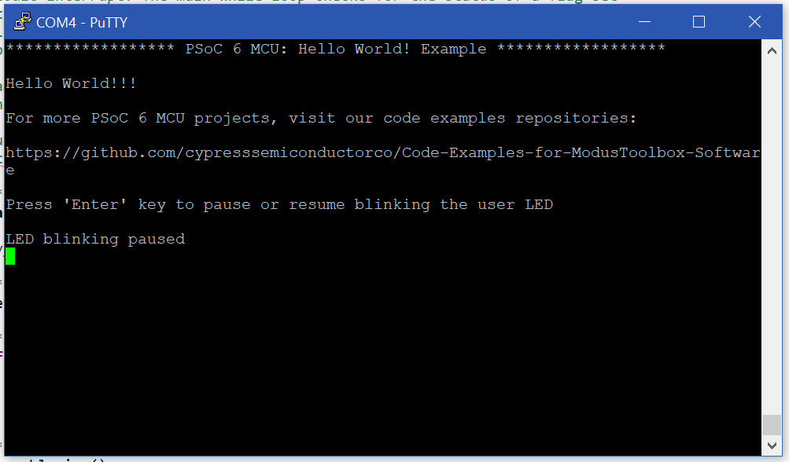

# Exercise 1 - Hello World!
Exercises performed for the course **'IoT'** given at Hasselt University at the faculty of Engineering Technology.
### Goal
First time using ModulusToolbox setting up an applaction using the template 'Hello World'. Building and programming the application onto the board. Reading the UART using the application called [Putty](https://www.putty.org/) with a Baud rate of 115200.

Pressing enter in the Putty console resumes or stops the blinking of the onboard user LED4. A generic Hello World is send to the console at start-up.

### Console output

## License
[MIT](https://choosealicense.com/licenses/mit/)