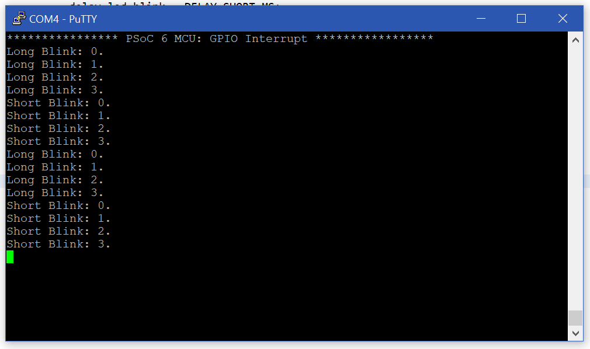

# Exercise 1 - GPIO Interrupt
Exercises performed for the course **'IoT'** given at Hasselt University at the faculty of Engineering Technology.
### Goal
Using the template called: "GPIO Interrupt". The template checks the interrupt status. When the button is pressed the delay between the toggling of the LED is switched between long or short. I added some ```printf()``` functions to better understand what is going on.

### Code
```C
...
for (;;)
    {
        /* Check the interrupt status */
        if (true == gpio_intr_flag)
        {
            gpio_intr_flag = false;

            /* Update LED toggle delay */
            if (DELAY_LONG_MS == delay_led_blink)
            {
                delay_led_blink = DELAY_SHORT_MS;
            }
            else
            {
                delay_led_blink = DELAY_LONG_MS;
            }
        }

        /* Blink LED four times */
        for (count = 0; count < LED_BLINK_COUNT; count++)
        {
        	if(delay_led_blink == DELAY_SHORT_MS){
        		printf("Short ");
        	} else{
        		printf("Long ");
        	}
        	printf("Blink: %d.\r\n", count);
            cyhal_gpio_write(CYBSP_USER_LED, CYBSP_LED_STATE_ON);
            cyhal_system_delay_ms(delay_led_blink);
            cyhal_gpio_write(CYBSP_USER_LED, CYBSP_LED_STATE_OFF);
            cyhal_system_delay_ms(delay_led_blink);
        }

        /* Enter deep sleep mode */
        cyhal_system_deepsleep();
    }
...
```

### Console output


## License
[MIT](https://choosealicense.com/licenses/mit/)