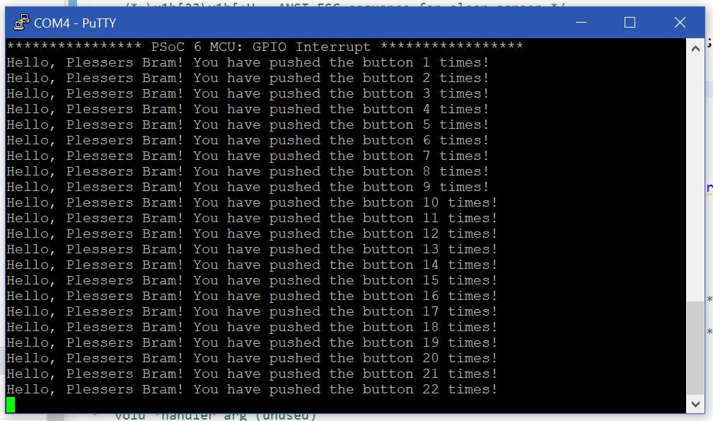

# Exercise 3 - Button UART
Exercises performed for the course **'IoT'** given at Hasselt University at the faculty of Engineering Technology.
### Goal
Changing the template called: "GPIO Interrupt". Removing the all the elements regarding the toggling of the LED but keeping the interrupt. Then using this interrupt to ```printf()``` to the UART bus. Which is again viewed using Putty. In additation I added the amount of times the button is pressed.

### Code
```C
...
for (;;)
    {
        /* Check the interrupt status */
        if (true == gpio_intr_flag)
        {
            gpio_intr_flag = false;
            count++;
            printf("Hello, Plessers Bram! You have pushed the button %d times!\r\n", count);
        }
        /* Enter deep sleep mode */
        cyhal_system_deepsleep();
    }
...
```

### Console output


## License
[MIT](https://choosealicense.com/licenses/mit/)