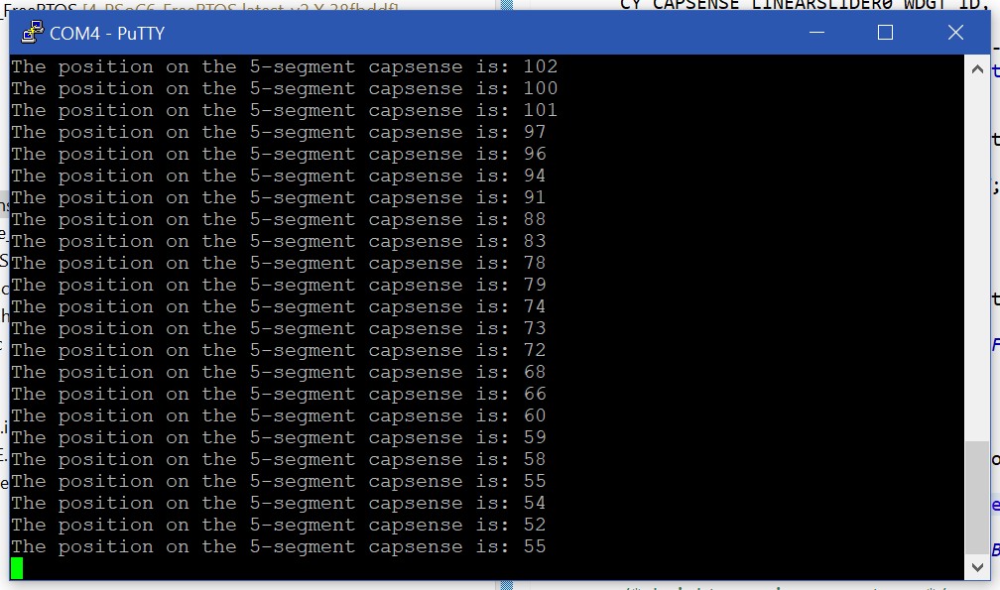

# Exercise 4 - FreeRTOS
Exercises performed for the course **'IoT'** given at Hasselt University at the faculty of Engineering Technology.
### Goal
Changing the template called: "CapSense Buttons and Slider FreeRTOS". The standard template uses the CapSense buttons at the bottom of the development and the slider. The buttons turn on or off the user LED. The slider is used to change the intensity of the user LED. The goal was to understand the code and write the value of the slider position to the terminal.

### Code
```C
...
    /* Detect new touch on slider */
    if((0u != slider_touched) && (slider_pos_perv != slider_pos ))
    {
    	printf("The position on the 5-segment capsense is: %d\r\n", slider_pos);

        led_cmd_data.command = LED_UPDATE_BRIGHTNESS;
      
        /* brightness in percentage */
        led_cmd_data.brightness = (slider_pos * 100) 
                    / cy_capsense_context.ptrWdConfig[CY_CAPSENSE_LINEARSLIDER0_WDGT_ID].xResolution;
        send_led_command = true;
    }
...
```

### Console output


## License
[MIT](https://choosealicense.com/licenses/mit/)